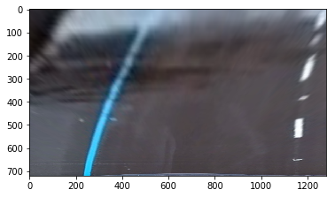

**Advanced Lane Finding Project**

The goals / steps of this project are the following:

* Compute the camera calibration matrix and distortion coefficients given a set of chessboard images.
* Apply a distortion correction to raw images.
* Use color transforms, gradients, etc., to create a thresholded binary image.
* Apply a perspective transform to rectify binary image ("birds-eye view").
* Detect lane pixels and fit to find the lane boundary.
* Determine the curvature of the lane and vehicle position with respect to center.
* Warp the detected lane boundaries back onto the original image.
* Output visual display of the lane boundaries and numerical estimation of lane curvature and vehicle position.

### Camera Calibration

#### 1. Briefly state how you computed the camera matrix and distortion coefficients. Provide an example of a distortion corrected calibration image.

To calibrate and undistort the image, i used the OpenCV's cv2.calibrateCamera() and cv2.undistort() functions, and by specifying object and image points i managed to fix the calibration and distortion on the image.

To find the chessboard corners, i used the cv2.findChessboardCorners() function, provided by OpenCV. First we convert the image to gray, then we apply the find chessboard corners function and then we draw and display the corners in the chessboard.

Here's the image with the marked corners:

### Pipeline (single images)

#### 1. Provide an example of a distortion-corrected image.

To undistort and calibrate the car image, i used the same logic as the one in the chessboard example. 

So here is the result in the car image:

#### 2. Describe how (and identify where in your code) you used color transforms, gradients or other methods to create a thresholded binary image.  Provide an example of a binary image result.

The steps to create a threshold binary image were the following:
    * Convert RGB to HLS
    * Apply OpenCV cv2.Sobel()
    * Threshold gradients s=(120,255), sx=(60,255)

#### 3. Describe how (and identify where in your code) you performed a perspective transform and provide an example of a transformed image.

To perform a birds-eye view, i first created a source and destination points, then called OpenCVs cv2.getPerspectiveTransform to get the transform matrix and then called another OpenCVs function called cv2.warpPerspective, to apply the birds-eye view transformation.

Here is the result image:

#### 4,5,6. Provide an example image of your result plotted back down onto the road such that the lane area is identified clearly.

To find the lines on the warped image i used the following procedure:
    * Apply histogram to find line peaks.
    * Find non zero pixels around histogram peaks.
    * Apply second order polynomial to each line.
    
To calculate the curvature, i did it using the following procedure:
    ploty = np.linspace(0, undistort.shape[0]-1, undistort.shape[0])
    y_eval = np.max(ploty)
    left_curverad = ((1 + (2*left_fit[0]*y_eval + left_fit[1])**2)**1.5) / np.absolute(2*left_fit[0])
    right_curverad = ((1 + (2*right_fit[0]*y_eval + right_fit[1])**2)**1.5) / np.absolute(2*right_fit[0])
    
And finally, to plot the result on the road i did the following procedure:
    * Apply OpenCVs cv2.fillPoly() function to draw the lines.
    * Warp back to original space image with OpenCVs cv2.warpPerspective.
    * Combine the result with original image using OpenCVs cv2.addWeighted.
    
Here is the result image:

---

### Pipeline (video)

#### 1. Provide a link to your final video output.  Your pipeline should perform reasonably well on the entire project video (wobbly lines are ok but no catastrophic failures that would cause the car to drive off the road!).

Here's a [link to my video result](./test_3.mp4)

---

### Discussion

#### 1. Briefly discuss any problems / issues you faced in your implementation of this project.  Where will your pipeline likely fail?  What could you do to make it more robust?

Here I'll talk about the approach I took, what techniques I used, what worked and why, where the pipeline might fail and how I might improve it if I were going to pursue this project further.  
